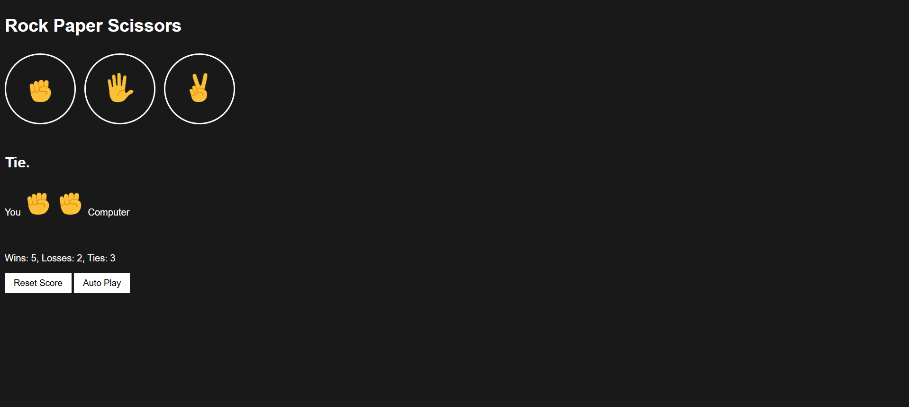

# Rock Paper Scissors Game

A simple interactive **Rock Paper Scissors** game built using **HTML, CSS, and JavaScript**.

This project was created while learning JavaScript and focuses on DOM manipulation, event handling, and local storage.

## Features

- Interactive Rock, Paper, Scissors gameplay
- Score tracking (Wins, Losses, Ties)
- Score persistence using Local Storage
- Keyboard shortcuts:
  - R → Rock
  - P → Paper
  - S → Scissors
- Auto-play mode
- Reset score functionality

## Technologies Used

- HTML
- CSS
- JavaScript

## Screenshot

## What I Practiced

- DOM manipulation
- Event listeners
- Local storage
- Game logic in JavaScript

## Live Demo

You can play the game here:

https://kadriazmi.github.io/rock-paper-scissors-game/
